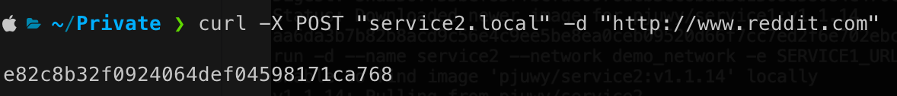

# Demo Services

This project demonstrates lifecycle management of two micro services.

"*Service1*" - takes hashing algorithm and message from the input and generates encoded message

"*Service2*" - reads website given as an input, sends it to the Service1 (together with the hashing algorithm, hardcoded to md5) and returns hashed message

## Improvements over default example
- Both microservices are written for Python3,
- Image size is greatly reduced by using python:3.13-slim instead of full python,
- By specifying a specific Python version, you ensure compatibility and stability, avoiding potential issues with future updates, and
- Docker image can be built for both amd64 and arm64 architecture - this is important because of the fwatchdog that is built for specific version

## CI-CD
Continious integration is ensured using github workflow (see .github/workflows/ci-cd.yml). Workflow is configured to be triggered whenever new tag (e.g., v2.0.0) is published - to push image with the release tag, or on each commit (i.e., to the main branch, not to the feature/bugfixes branches) to push the image with the latest tag. The flow is as follows:
1. Chekout the source code
2. Setup Python (3.13, for pytest)
3. Install pytest
4. Run unit test for Service1
5. Run unit tests for Service2
6. Run e2e tests
7. Setup docker buildx (for multiplatform images)
8. Login to dockerhub in order to push images
9. IF EVERYTHING BEFORE succeeded (e.g., tests) build and push image for Service1
10. IF EVERYTHING BEFORE succeeded (e.g., tests) build and push image for Service2 

This was parallelised using matrix of services (service1 and service2). The job will be executed on two workers, one for each service. The unit test will run depending on the context - for service1 or service2, and build will also run per service.

This resulted in improvement of around half a minute in the building process (~60 sec comapring to ~90 sec). If not built for 2 architectures, build process would finish in around 40 seconds.

Published images can be found on the [Docker Hub repo](https://hub.docker.com/u/pjuwy).

## Deployment in docker
For the purpose of conteinerised deployment, two approaches are implemented:

### Deploy using docker compose

Docker compose is configured to use latest image, and passes environment variable `SERVICE1_URL` to the service2.
Service2 exposes port 8080 to local port 8080 for the testing purposes. Common docker network is created so containers can comminicate using names.

Full docker compose:
```
version: '3.8'

services:
  service1:
    image: pjuwy/service1:latest
    container_name: service1
    networks:
      - microservices-network
    expose:
      - 8080

  service2:
    image: pjuwy/service2:latest
    container_name: service2
    networks:
      - microservices-network
    environment:
      - SERVICE1_URL=http://service1:8080
    depends_on:
      - service1
    ports:
      - "8080:8080"
    expose:
      - 8080

networks:
  microservices-network:
    driver: bridge
```

Execution example: `docker compose -f docker-compose.yml up`

#### Result:

Containers:

Execution:


### Deploy using shell script

Script steps:
1. Create docker network that both newly created containers will be connected to,
2. Detect if the containers already exist - if so, delete them,
3. Run new containers with the provided tags, and finally,
4. Run one test to test the service.

Script usage:
```
Usage: ./deployment.sh [OPTIONS]

Options:
  --service1_tag=<tag>    Docker tag for service1 (default: latest)
  --service2_tag=<tag>    Docker tag for service2 (default: latest)
  --port=<port>           Port to expose for service2 (default: 8080)
  --network=<name>        Name of the Docker network (default: demo_network)

Examples:
  ./deployment.sh                          # Deploy with default values
  ./deployment.sh --service1_tag=v1.0.0 --service2_tag=v1.0.0 --port=9090 --network=my_network
```

#### Result:

Script execution:

Containers:

Execution:


## Deployment using kubernetes

Similarly, as in the previous examples, here we have three deployment options:

### Deployment using kubernetes manifests
Here, everything is hardcoded, number of replicas, ports, url of service1, and names.

Three manifest files are created:

1. service1.yaml - deployment with 1 replica and service with 8080 exposed port
2. service2.yaml - deployment with 1 replica and service with 8080 exposed port (also, SERVICE1_URL is passed to Service2)
3. ingress.yaml - host on `service2.local` forward to service2 on 8080 port inside the cluster

In order to run this solution, first minikube has to be started (using docker environment) `minikube start --addons=ingress`

After the minikube is available, all manifests should be applied:

1. `kubectl apply -f k8s/simple_manifest/service1.yaml`
2. `kubectl apply -f k8s/simple_manifest/service2.yaml`
3. `kubectl apply -f k8s/simple_manifest/ingress.yaml`

Since this was done on M1 Mac, it was not an option to resolve `service2.local` to the IP of the minikube, instead it should be resolved to `127.0.0.1` in `/etc/hosts`. After that is done, simple `minikube tunnel` will enable us to use the service.

#### Result:

Cluster:


Execution:


### Deployment using helm charts
For this option, helm chart is created in order to deploy both services with ingress, variable parameters are: image repository and tag (version), url for the Service1 (used within the Service2), and host for ingress.

Prerequisites to deploy, are the same as in the previous option:

In order to run this solution, first minikube has to be started (using docker environment) `minikube start --addons=ingress`
Since this was done on M1 Mac, it was not an option to resolve `service2.local` to the IP of the minikube, instead it should be resolved to `127.0.0.1` in `/etc/hosts`. After that is done, simple `minikube tunnel` will enable us to use the service.

Example deployment: `helm upgrade --install service-chart ./service-chart --set service1.image.tag=v1.1.13 --set service2.image.tag=v1.1.13`

#### Result:

Cluster:


Execution:


### Deploy using shell script

Script steps:
1. Use helm to upgrade or install cluster anew.

Script usage:
```
Usage: ./deployment.sh [options]
Options:
  --namespace        Kubernetes namespace (default: default)
  --service1-tag     Tag for service1 image (default: latest)
  --service2-tag     Tag for service2 image (default: latest)
  --ingress-host     Host for service2 ingress (default: service2.local)
  -h, --help         Display this help message
```

#### Result:
Script execution:


Cluster:


Execution:



